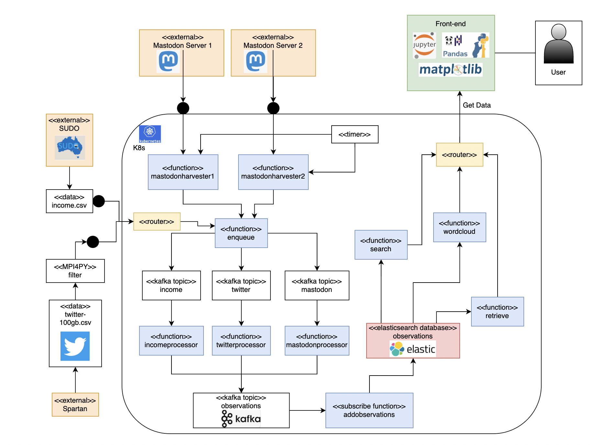

# 2024 S1 Cluster and Cloud Computing Assignment 2

## 1. Description

This project aims to harness these data integration platforms and tools—Twitter, Mastodon, and SUDO—to deeply explore the impact of AI and data science on people's lives. Specific case studies include the public's emotional attitudes towards Artificial Intelligence (AI), electric vehicles (EVs), telecommunications, and 5G, as well as how these sectors relate to people's income level.

## 2. Architecture



## 3. General Folder Strucures

For Backend Application, access [backend](#backend)

For Frontend Application, access [frontend](#frontend)

For Elasticseach code and data, access [database](#database)

For test code, access [tests](#tests)

For report and API documents, access [docs](#docs)

## 4. Requirements:

- Ensure OpenStack client version 6.3.x is installed, along with the following modules: python- cinderclient, python-keystoneclient, python-magnumclient, python-neutronclient, python-novaclient, and python-octaviaclient.
- Install JQ version 1.6.x for processing JSON data.
- Install Kubectl version 1.26.8 for managing Kubernetes clusters.
- Connect to the campus network if on-campus, or use the UniMelb Student VPN if off-campus.

## 5. Installations

- Install Elasticsearch

```shell
export ES_VERSION="8.5.1"

kubectl create namespace elastic
helm repo add elastic https://helm.elastic.co
helm repo update
helm upgrade --install \
  --version=${ES_VERSION} \
  --namespace elastic \
  --set replicas=2 \
  --set secret.password="elastic"\
  --set volumeClaimTemplate.resources.requests.storage="100Gi" \
  elasticsearch elastic/elasticsearch
```

- Install Fission

```shell
export FISSION_VERSION='1.20.0'

kubectl create -k "github.com/fission/fission/crds/v1?ref=v${FISSION_VERSION}"

helm repo add fission-charts https://fission.github.io/fission-charts/
helm repo update
helm upgrade fission fission-charts/fission-all --install --version v${FISSION_VERSION} --namespace fission \
  --create-namespace --set routerServiceType='ClusterIP'
```

- Install Keda & Kafka

```shell
export KEDA_VERSION='2.9'

helm repo add kedacore https://kedacore.github.io/charts
helm repo add ot-helm https://ot-container-kit.github.io/helm-charts/
helm repo update
helm upgrade keda kedacore/keda --install --namespace keda --create-namespace --version ${KEDA_VERSION}

export STRIMZI_VERSION='0.38.0'

helm repo add strimzi https://strimzi.io/charts/
helm repo update
helm upgrade kafka strimzi/strimzi-kafka-operator --install --namespace kafka\
   --create-namespace --version ${STRIMZI_VERSION}
```

- Install Kibana

```shell
helm upgrade --install \
  --version=${ES_VERSION} \
  --namespace elastic \
  -f ./installation/kibana-values.yaml \
  kibana elastic/kibana
```

## 6. Tabel of Contents

-  [backend](#)
    -  [README.md](#): Detailed instructions on how to use and create backend.
    -  [fission](#)
        - [functions](#): Folder that stored all fission functions.
        - [specs](#): Folder that stored all fission configuration YAML files.
        - [Dockerfile](#) Docker image that used to create fission python environment.
    -  [kafka](#)
        - [topics](#): Folder that contains topic configuration YAML files.
        - [kafka-cluster.yaml](#): File that used to create Kafka cluster.
    
-  [database](#)
    - [schema](#): Folder that contains JSON schema files which used to create the Elasticsearch
        indexes.
    - [sudo-download](#): Folder that contains download CSV file from SUDO.
    - [twitter-upload](#): Folder that contains scripts to download Twitter data from Spartan with
        MPI4PY and downloaded JSON data.
    - [uploader](#): Folder that contains scripts to upload JSON data to Elasticsearch with Fission
        enqueue route.
-  [frontend](#)
    -  [README.md](#): Detailed instructions on how to use and create frontend.
    -  [es data](#): Folder that stores all the fetched data from Elasticsearch.
    -  [plots](#): Folder that stores all plots generated by Jupyter Notebooks.
    -  [shapefile](#): SA4 shapefile that used to plot maps.
    -  [AsyncFissionClient.py](#): Python script that fetch data asynchronously for frontend
    -  [DataAnalyzer.py](#): Python script designed for analyzing and visualizing data retrieved from
        the server.
    -  [ScenarioAnalyzer.py](#): Python script for creating various types of plots to analyze and
        compare data across different scenarios.
    -  [frontend {scenario}.ipynb](#): 4 Jupyter Notebooks that related to AI, EV, Telecommunications, 5G scenarios.
    -  [api test.ipynb](#): Code for test whether the data can be obtained successfully
    
-  [tests](#): Folder that contains 4 iterations to test connection and functions with Elasticsearch.

-  [docs](#docs):
    - [CCC2024-Team41.pdf](#): The final report for COMP90024.
    - [README.md](#): API document of backend.
    - [API-doc.pdf](#): PDF version of API document.

## 7. Contact 

Jiajun Li (1132688) - jiajun.li3@student.unimelb.edu.au  

Luxi Bai(1527822) - luxi.bai@student.unimelb.edu.au  

Qingze Wang (1528654) - qingze.wang1@student.unimelb.edu.au 

Wenxin Zhu (1136510) - wenxin.zhu1@student.unimelb.edu.au 

Ze Pang (955698) - zep@student.unimelb.edu.au 

## 8. Links

Youtube links for video presentation: https://www.youtube.com/watch?v=YtfrEGT4BsE
